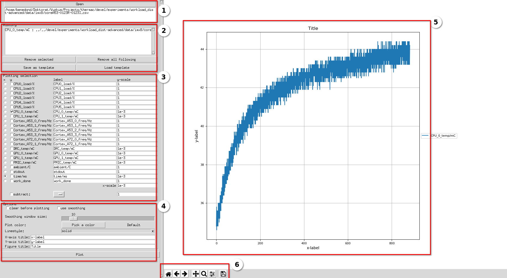

# Thermobench Data Visualizer

Thermobench data visualizer (TDV) is a GUI application written in Python3 tkinter framework for visualizing `.csv` files generated by Thermobench.
The application allows user to select x/y data to be plotted, set labels and scales, and save the figure.

In the future, additional features can be added, such as automatic finding of the exponential function parameters.

## Dependencies

The application is written in `Python3` in `tkinter` framework. 
The application also uses
 - `matplotlib` package for plotting;
 - `pandas` package for loading the `.csv` files;
 - `numpy` package for interpolation;
 - `json` package for working with the figure templates.
 
## How to run

Just run the Python script:
  ```python3 data_visualizer.py```
  If all dependencies are correctly installed, the GUI will appear.  
 

## GUI description



The GUI consists of two major frames, including `menu` (1-4), and `plotting area` (5, 6).

1. File selection
    - By clicking on the `Open` button, file dialog appears, allowing the user to select the `.csv` file.
    - After selecting the file, the selected filepath is displayed in the text area below the `Open` button.

2. Plotting history
    - The individual lines plotted into the plotting area are logged in the listbox widget.
    - Below the logging area, there are several buttons allowing the user to
        - Remove a selected line.
        - Remove a selected line and all other following the selected one.
        - Save the currect plot as into `.tdvt` file (basically `.json` file containing the information needed to make the plot).
            - When the current plot is saved, user selects the file path where the template will be saved. All paths to plotted data are then stored relatively to this path.
        - Load `.tdvt` file.
    
3. Data-plotting selection
    - When some `.csv` file is selected, Plotting selection section appears, showing all columns of the `.csv` file.
        - In `x` column, user specifies, which data should be used for x-axis.
        - In `y` column, user can select one or multiple data columns to be used for y-axis.
        - The `label` specifies the string which appears in the legend. 
        - The `scale` is a factor, by which the data is multiplied before plotting.
    - `Subtract` option can be selected to subtract some column data from the selected `y` columns before plotting.
    
4. Plotting options
    - `clear before plotting option` clears the figure before plotting the selected data. If this option is not selected, the figure will just be updated - this way, data from multiple `.csv` files can be plotted in a single figure.
    - When the `smoothing` option is selected, the `rolling window` (mean) is used to pre-process the data before plotting. The size of the window is specified by `rolling window size` slidebar (number from 1 to 100).
    - Style of the plot can be adjusted by selecting the linestyle and plot color. If no color is selected, default colorscheme defined in the global array `default_colors` is used.
    - Descriptions of the figure can be set in `x-axis title`, `y-axis title` and `figure title` fields. Note that the descriptions will be updated after clicking on the `Plot` button.
    - The `Plot` button causes the figure to be re-plotted, possibly adding selected data from data-plotting section, and/or updating the labels set in the plotting options.

5. Figure
    - The data are plotted here, by using the matplotlib.pyplot `plot` function.
 
6. Toolbar
    - By clicking on the rightmost icon, the current figure can be saved to `.png` file.  

## Issues

- In Ubuntu 18.04, the GUI sometimes seemingly freezes after selecting the `.csv` file. In that case, pushing some key (e.g., `ALT` or `CTRL`) helps. This bug is connected with the (re)rendering of the widgets. It was not observed on Ubuntu 16. The GUI was not tested on other OS. 