# Report generation

## Using graphgen.py

### Arguments:  
	-f, --csv_file - CSV file(s) to process ( Required )  
	-o, --out_dir - Output directory for the graphs ( Default: ./ )  
	-x, --x_axes_str - Create graphs with x axes being the columns containing these strings ( Default: First column of first file )  
	--plot_col - Only plot the columns with these names while plotting across csv files ( Default: All columns )  
	-e, --extension - Specify the extension of the graphs ( Default: svg )  
	-c, --categories - Plot by category ( Default: no category )   

### Basic functionality

Read supplied csv files, create graphs from the columns they have in common, and store them. As default, the x axis is the first column in the first file.  

Ignores the first line of the csv file, as it commonly holds the name of the command which generated it.

Output filenames are of the format: all:x_axis-y_axis.extension

####CSV files used in example:

    a.csv:                 b.csv:                 c.csv:
    
    firstline              firstline              firstline
    x0, y1, y2, y3         y1, x0, y2, z4         x0, y1, y3, z4
    1,  2,  8,  4          1,  1,  9,  5          1,  4,  8,  6
    2,  4,  4,  3          2,  3,  5,  4          2,  6,  4,  5
    3,  8,  2,  2          4,  7,  3,  3          3,  7,  2,  4

As seen from the structure of the csv files:  
1. The order of columns can be different from file to file  
2. Not all files have to contain the same columns

#### Example usage:
    python graphgen.py -f example/a.csv example/b.csv example/c.csv -o example/figs/graphgen

#### Generated graphs:  

|example/figs/graphgen/all:x0-y1.svg|example/figs/graphgen/all:x0-y2.svg
:-------------------------:|:-------------------------:
 | 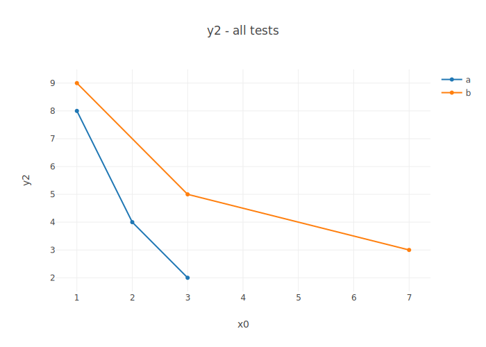

|example/figs/graphgen/all:x0-y1.svg|example/figs/graphgen/all:x0-y2.svg
:-------------------------:|:-------------------------:
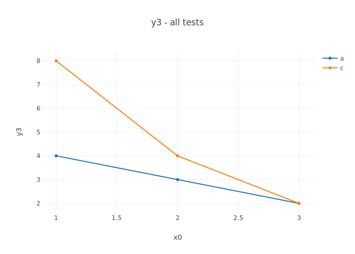 | 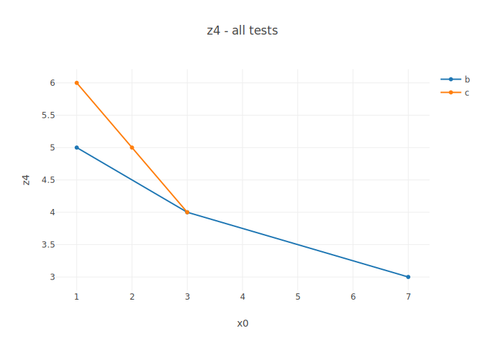

### Features
#### 1. Plot by category

Plots graphs by category: for each test separately, parses columns for search strings and plots them with a common name on the y axis. The search string and the name are input arguments in dict form: '{"searchstring":"name"}'. 

Output filenames are of the format: benchmark_name:x_axis-category_name.extension 

##### Example:
	python graphgen.py -f example/a.csv example/b.csv example/c.csv -o example/figs/graphgen -c '{"y":"Ytitle","z":"Ztitle"}'

##### Generated graphs: 
 
Graphs generated by the basic functionality, and:

|example/figs/graphgen/a:x0-Ytitle.svg|example/figs/graphgen/b:x0-Ytitle.svg|example/figs/graphgen/c:x0-Ytitle.svg|
:-------------------------:|:-------------------------:|:-------------------------:
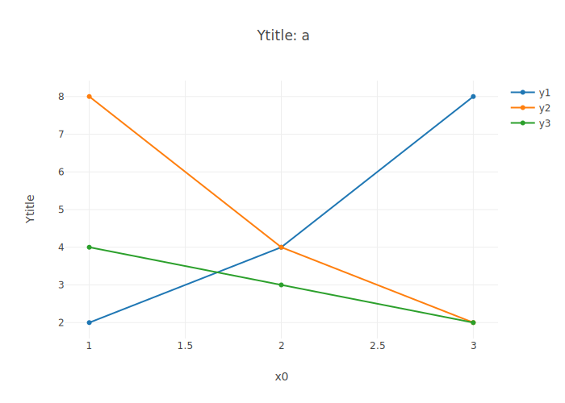 | 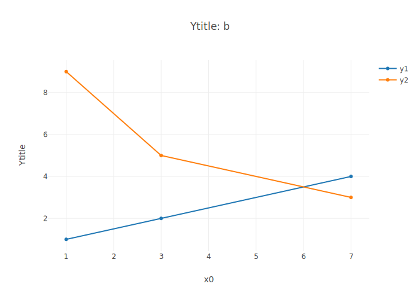 | 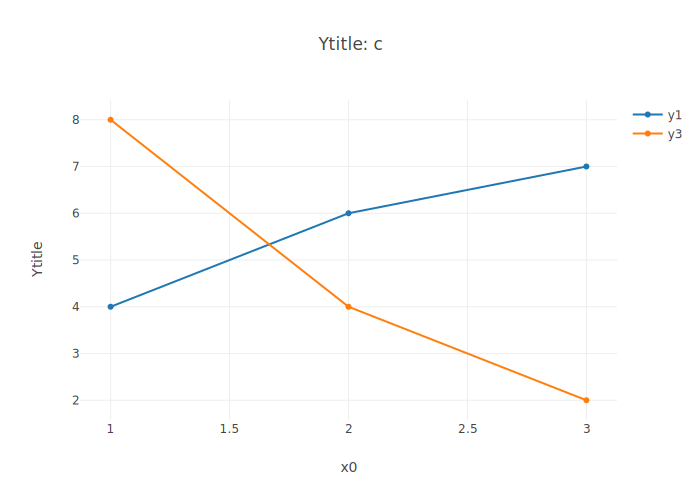

|example/figs/graphgen/b:x0-Ztitle.svg|example/figs/graphgen/c:x0-Ztitle.svg|
:-------------------------:|:-------------------------:
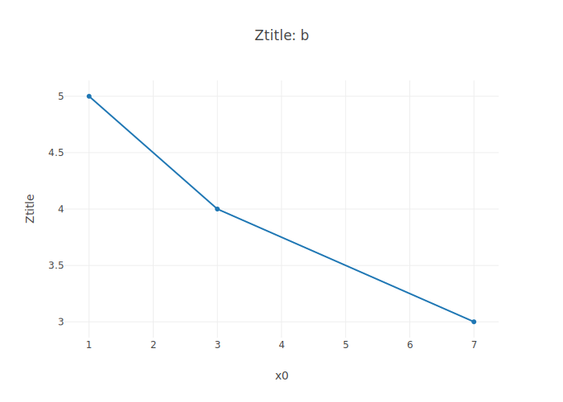 | 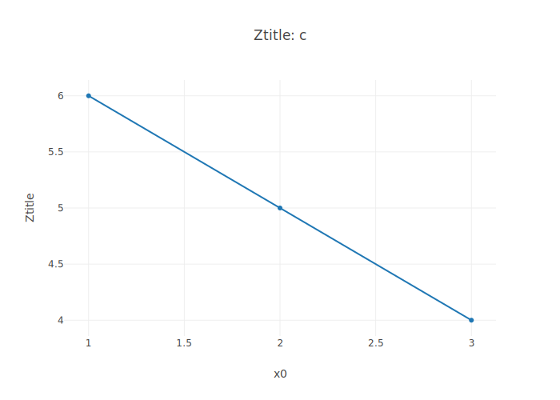

#### 2. Plot on multiple custom x axes

The input x axes do not have to match with the columns perfectly; e.g. -x y would plot with x axes y1,y2,y3.

##### Example:
	python graphgen.py -f example/a.csv example/b.csv example/c.csv -o example/figs/graphgen -x z y2

##### Generated graphs: 

|example/figs/graphgen/all:y2-x0.svg|example/figs/graphgen/all:y2-y1.svg|example/figs/graphgen/all:y2-y3.svg|example/figs/graphgen/all:y2-z4.svg|
:-------------------------:|:-------------------------:|:-------------------------:|:-------------------------:
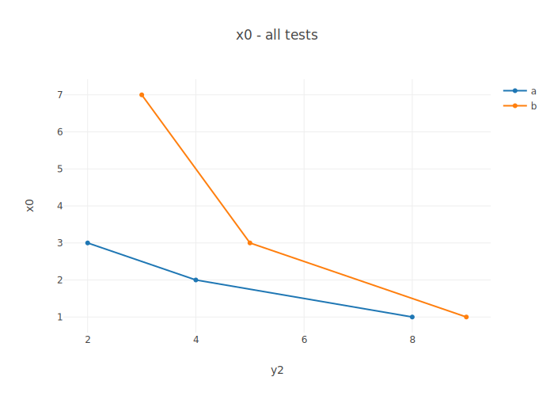 | 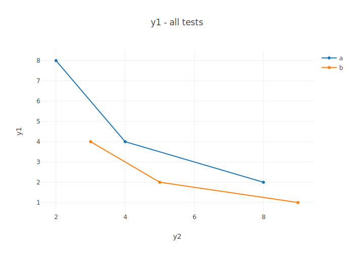 | |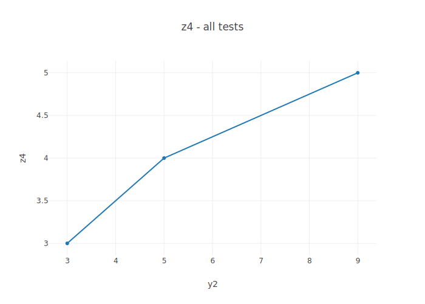

|example/figs/graphgen/all:z4-x0.svg|example/figs/graphgen/all:z4-y1.svg|example/figs/graphgen/all:z4-y2.svg|example/figs/graphgen/all:z4-y3.svg|
:-------------------------:|:-------------------------:|:-------------------------:|:-------------------------:
 | 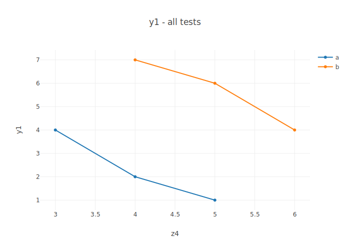 | 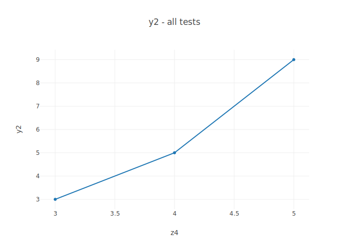|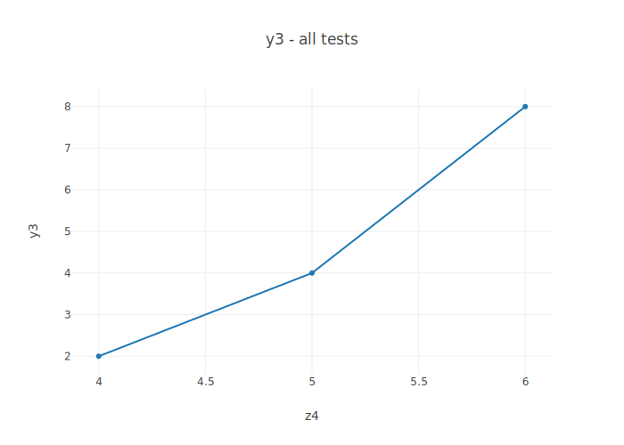

#### 3. Only plot specific columns

The input column names do not have to match with the columns perfectly; e.g. --plot_col y would plot columns y1,y2,y3.

##### Example:
	python graphgen.py -f example/a.csv example/b.csv example/c.csv -o example/figs/graphgen --plot_col y1 z

##### Generated graphs: 
|example/figs/graphgen/all:x0-y1.svg|example/figs/graphgen/all:x0-z4.svg|
:-------------------------:|:-------------------------:
 |  

#### 4. Set extension of output graphs

    Supported extensions are: "png", "jpeg", "webp", "svg", "pdf", "eps" and "html". 

    "html" creates an interactive plotly graph.

##### Example:
    python graphgen.py -f example/a.csv example/b.csv example/c.csv -o example/figs/graphgen --plot_col y1 -e png svg html

##### Generated graphs: 
|example/figs/graphgen/all:x0-y1.png|example/figs/graphgen/all:x0-y1.svg|
:-------------------------:|:-------------------------:
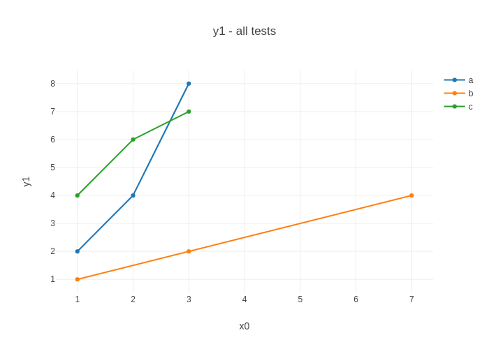 | 

**example/figs/graphgen/all:x0-y1.html**
<iframe frameborder=0 width="600" height="400" src=./example/figs/graphgen/all:x0-y1.html></iframe>

## Using htmlgen.py

### Arguments: 
    -f,--fig_dir - Path to the figures directory ( Required )
    -t, --thumbnail_type - Extension of thumbnails on the main page ( Required )
    -g, --graph_type - Extension of graphs ( Required )
    -o, --out_dir - Output directory for the report ( Default: current dir )

### Functionality:

Creates a html report from the graphs found in the figures directory. The report has 3 types of pages: the main page summarizing the individual tests by category, the pages for the individual tests themselves, and a page for comparing sensor outputs for all tests.

All html pages are stored in a subdirectory of the output dir called htmls. An initial page called main.html is also stored in the output dir, which is just a redirect to the main page in the htmls directory.

#### Graph format requirements
The graphs should have consistent naming of the form "category:x_axis-y_axis.extension", or "all:x_axis-y_axis.extension" if is is a graph comparing all tests run.

The graphs are separated by filename prefix: files starting with filename "all:" are put on the comparison page: all others are grouped by category "category:". They are further grouped by their x axis and then finally by y axis.

### Example

#### Command used to generate graphs for the example:
    python graphgen.py -f example/a.csv example/b.csv example/c.csv -o example/figs/htmlgen -c '{"y":"Y","z":"Z"}'

#### Graphs generated:
    all:x0-y1.svg
    all:x0-y2.svg
    all:x0-y3.svg
    all:x0-z4.svg
    a:x0-Y.svg
    b:x0-Y.svg
    b:x0-Z.svg
    c:x0-Y.svg
    c:x0-Z.svg

#### Command used to generate example report:
    python htmlgen.py -f ./example/figs/htmlgen -t svg -g svg -o example/report

#### Webpage generated:
<iframe frameborder=0 width="800" height="600" src=./example/report/main.html></iframe>
