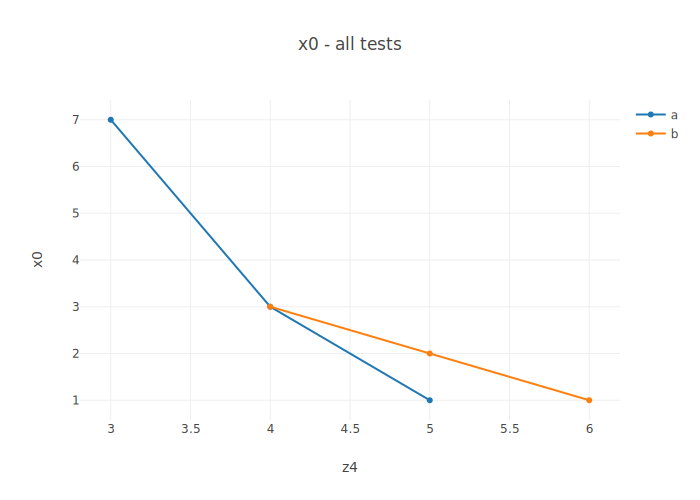

# Report generation tools

Report generation consists of 2 stages:

1. Generate graphs from csv files, either from columns with the same name across csv files, or by grouping columns of a single csv file. 
2. Generate a webpage summarizing measured data, with 2 main pages:
    - One summarizing graphs for each csv file separately in a table
    - One with graphs comparing columns across csv files

The graph generator tool can easily be used in a standalone way.

## Using graph generator (graphgen.py)

### Arguments 
	-f, --csv_file - CSV file(s) to process ( Required )  
	-o, --out_dir - Output directory for the graphs ( Default: ./ )  
	-x, --x_axes_str - Create graphs with x axes being the columns containing these strings ( Default: First column of first file )  
	--plot_col - Only plot the columns with these names while plotting across csv files ( Default: All columns )  
	-e, --extension - Specify the extension of the graphs ( Default: svg )  
	-c, --categories - Plot by category ( Default: no category )   

### Requirements:

The required packages can be installed with the command:

	pip3 install pandas cufflinks scipy orca

### Basic functionality

Read supplied csv files, create graphs from the columns they have in common, and export them to the specified format. As default, the x axis is the first column in the first file.  

Ignores the first line of the csv file, as it commonly holds the name of the command which generated it.

Output filenames are of the format: all:x_axis-y_axis.extension

#### Input files specification

The program accepts comma separated csv files.

The order of columns can be random, and each file may contain different columns, not necessarily present in all files. 

Lines starting with hash(#) are ignored. 

##### Input files example

    a.csv:                 b.csv:                 c.csv:
    
    # Comment              # Comment              # Comment
    x0, y1, y2, y3         y1, x0, y2, z4         x0, y1, y3, z4
    1,  2,  8,  4          1,  1,  9,  5          1,  4,  8,  6
    2,  4,  4,  3          2,  3,  5,  4          2,  6,  4,  5
    3,  8,  2,  2          4,  7,  3,  3          3,  7,  2,  4

### Examples of usage

#### Basic usage

##### Sample command
    python3 graphgen.py -f example/a.csv example/b.csv example/c.csv -o example/figs/graphgen

##### Sample output  

|example/figs/graphgen/all:x0-y1.svg|example/figs/graphgen/all:x0-y2.svg
:-------------------------:|:-------------------------:
 | 

|example/figs/graphgen/all:x0-y1.svg|example/figs/graphgen/all:x0-y2.svg
:-------------------------:|:-------------------------:
 | 

#### Category plot by file

For each csv file, selects columns containing given strings and plots them with a common name on the y axis. E.g. the category name can be Frequency, and we may search for the string "freq" to group those columns together. 

The search string and the name are input arguments in dict form: '{"searchstring":"name"}'. 

Output filenames are of the format: benchmark_name:x_axis-category_name.extension 

##### Sample command
	python3 graphgen.py -f example/a.csv example/b.csv example/c.csv -o example/figs/graphgen -c '{"y":"Ytitle","z":"Ztitle"}'

##### Sample output  
 
Graphs generated by the basic functionality, and:

|example/figs/graphgen/a:x0-Ytitle.svg|example/figs/graphgen/b:x0-Ytitle.svg|example/figs/graphgen/c:x0-Ytitle.svg|
:-------------------------:|:-------------------------:|:-------------------------:
 |  | 

|example/figs/graphgen/b:x0-Ztitle.svg|example/figs/graphgen/c:x0-Ztitle.svg|
:-------------------------:|:-------------------------:
 | 

#### Custom x axes

With this argument you can select source data for x axes. 

Graphs with these x axes are generated for all plots, including category plots.

The input x axes do not have to match with the columns perfectly; e.g. -x y would plot with x axes y1,y2,y3.

##### Sample command
	python3 graphgen.py -f example/a.csv example/b.csv example/c.csv -o example/figs/graphgen -x z y2

##### Sample output 

|example/figs/graphgen/all:y2-x0.svg|example/figs/graphgen/all:y2-y1.svg|example/figs/graphgen/all:y2-y3.svg|example/figs/graphgen/all:y2-z4.svg|
:-------------------------:|:-------------------------:|:-------------------------:|:-------------------------:
 |  | |

|example/figs/graphgen/all:z4-x0.svg|example/figs/graphgen/all:z4-y1.svg|example/figs/graphgen/all:z4-y2.svg|example/figs/graphgen/all:z4-y3.svg|
:-------------------------:|:-------------------------:|:-------------------------:|:-------------------------:
 |  | |

#### Limit columns with pattern

From the columns used in the basic use case, select the ones containing some pattern and plot using only those.

The input patterns do not have to match with the columns perfectly; e.g. --plot_col y would plot columns y1,y2,y3.

##### Sample command
	python3 graphgen.py -f example/a.csv example/b.csv example/c.csv -o example/figs/graphgen --plot_col y1 z

##### Sample output 
|example/figs/graphgen/all:x0-y1.svg|example/figs/graphgen/all:x0-z4.svg|
:-------------------------:|:-------------------------:
 |  

#### Output files extension

Supported extensions are: "png", "jpeg", "webp", "svg", "pdf", "eps" and "html". 

"html" creates an interactive plotly graph.

##### Sample command
    python3 graphgen.py -f example/a.csv example/b.csv example/c.csv -o example/figs/graphgen --plot_col y1 -e png svg html

##### Sample output 
|example/figs/graphgen/all:x0-y1.png|example/figs/graphgen/all:x0-y1.svg|
:-------------------------:|:-------------------------:
 | 

**example/figs/graphgen/all:x0-y1.html**
See example in example/figs/graphgen/all:x0-y1.html

## Using htmlgen.py

### Arguments: 
    -f, --fig_dir - Path to the figures directory ( Required )
    -t, --thumbnail_type - Extension of thumbnails on the main page ( Required )
    -g, --graph_type - Extension of graphs ( Required )
    -o, --out_dir - Output directory for the report ( Default: current dir )

### Functionality

Creates a html report from the graphs found in the figures directory. The report has 3 types of pages: the main page summarizing the individual tests by category, the pages for the individual tests themselves, and a page for comparing sensor outputs for all tests.

All html pages are stored in a subdirectory of the output dir called htmls. An initial page called main.html is also stored in the output dir, which is just a redirect to the main page in the htmls directory.

#### Graph format requirements
The graphs should have consistent naming of the form "category:x_axis-y_axis.extension", or "all:x_axis-y_axis.extension" if is is a graph comparing all tests run.

The graphs are separated by filename prefix: files starting with filename "all:" are put on the comparison page: all others are grouped by category "category:". They are further grouped by their x axis and then finally by y axis.

### Example

#### Command used to generate graphs for the example
    python3 graphgen.py -f example/a.csv example/b.csv example/c.csv -o example/figs/htmlgen -c '{"y":"Y","z":"Z"}'

#### Graphs generated
    all:x0-y1.svg
    all:x0-y2.svg
    all:x0-y3.svg
    all:x0-z4.svg
    a:x0-Y.svg
    b:x0-Y.svg
    b:x0-Z.svg
    c:x0-Y.svg
    c:x0-Z.svg

#### Command used to generate example report
    python3 htmlgen.py -f example/figs/htmlgen -t svg -g svg -o example/report

#### Webpage generated
See example in example/report/main.html
